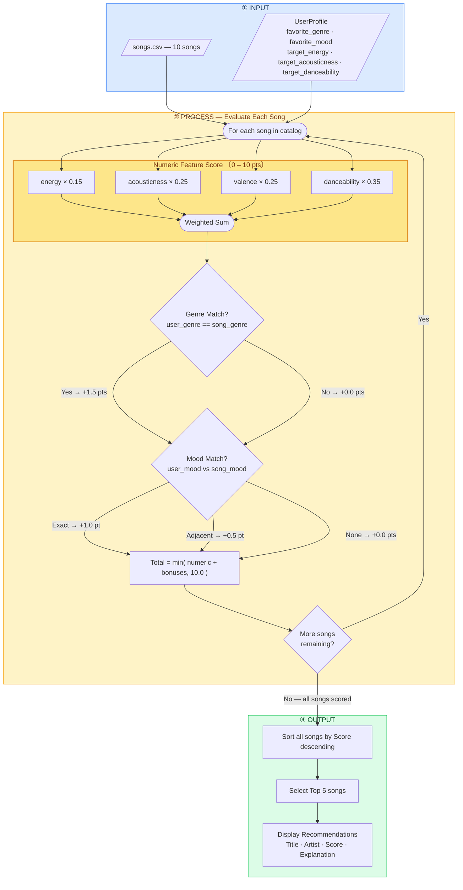

# Music Recommender — Algorithm Flowchart

Visual overview of the scoring pipeline: how `songs.csv` and a `UserProfile`
flow through the weighted-feature + bonus recipe to produce the Top 5
recommendations.

## Algorithm Recipe Summary

| Layer | Signal | Points |
|---|---|---|
| Numeric features | Weighted similarity across energy, acousticness, valence, danceability | 0 – 10 |
| Genre bonus | Exact match: `user_genre == song_genre` | +1.5 |
| Mood bonus (exact) | `user_mood == song_mood` | +1.0 |
| Mood bonus (adjacent) | Similar mood per adjacency map | +0.5 |
| **Cap** | `min(total, 10.0)` | **max 10** |
